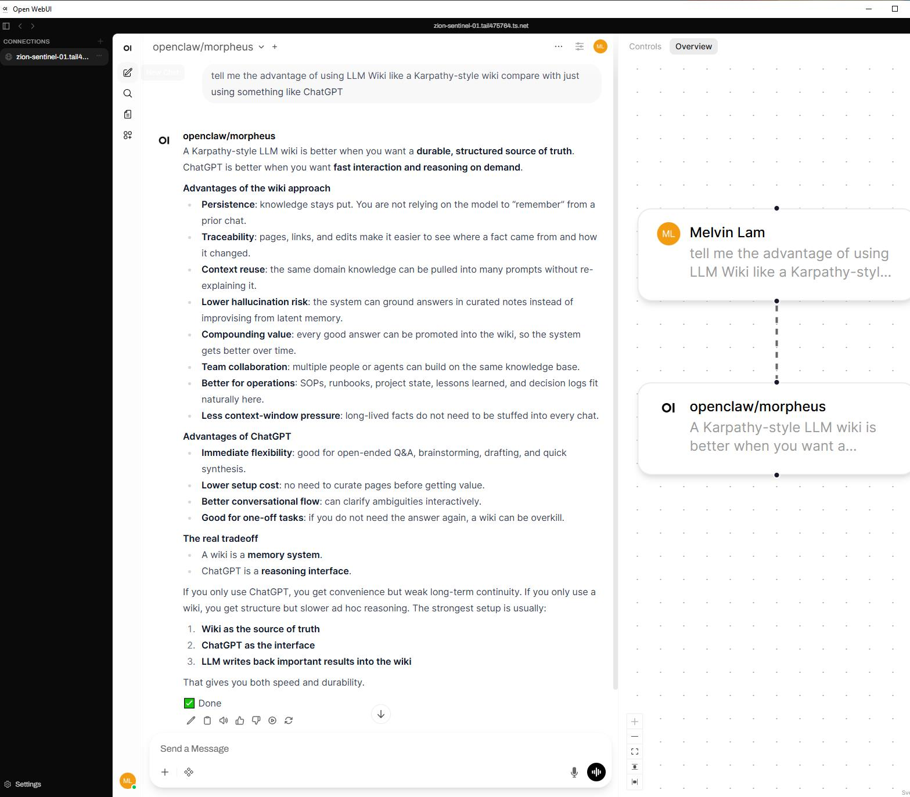
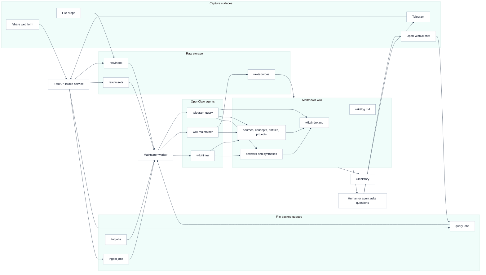

# llm-wiki

`llm-wiki` is a markdown-first knowledge system for people and AI agents.

It turns messy saved material into a durable wiki that can be queried from chat.
Instead of relying on a model to remember what was said in an old conversation,
the system keeps raw captures, source notes, synthesized pages, and saved answers
in a Git-backed filesystem.



## Architecture at a glance



## What LLM Wiki does

LLM Wiki gives you a private knowledge base that agents can keep improving:

- capture links, files, PDFs, notes, and chat messages from phone or laptop
- preserve original source material in `raw/`
- ask agents to de-batch, summarize, categorize, dedupe, and link that material
- promote durable outputs into markdown pages under `wiki/`
- answer questions through Open WebUI or Telegram using the maintained wiki as context
- save useful answers back into the wiki so the system compounds over time

The code stays intentionally small. It handles capture, storage, queues, status,
and dispatch. OpenClaw agents handle the judgment-heavy work: reading messy
inputs, finding structure, filling gaps, and improving wiki pages.

## Usage examples

### Research capture

Send a group of X, Reddit, YouTube, GitHub, or article links into Telegram or the
web intake form. LLM Wiki stores the bundle, then the maintainer agent splits it
into atomic source notes and promotes durable takeaways into topic pages.

### Cooking videos

Save a YouTube cooking playlist. The ingest agent can process videos one by one,
extract ingredients and cooking methods, and create recipe pages that are easier
to search than the original playlist.

### PDF and file drops

Drop a PDF, screenshot, or document into the inbox. The raw asset remains
available for provenance, while agents can extract concepts, glossary terms,
project notes, or saved answers into structured markdown.

### Agent memory

Ask a question such as: "What did I save about autonomous agents and queue
failures?" The query path searches the maintained wiki first, then raw sources
when needed, so answers are grounded in saved material rather than chat memory
alone.

### Writeback

When an answer is useful, save it into `wiki/answers/` or `wiki/syntheses/`.
That makes the next agent or chat session smarter without requiring a long prompt
history.

## How it works

### Capture

New material comes in through:

- the `/share` web form
- Telegram messages and attachments
- optional WhatsApp webhook capture
- direct browser edits in SilverBullet
- manual file drops into the repo

Captured material lands in:

- `raw/inbox/` for intake notes
- `raw/assets/` for uploaded files such as PDFs and images

Capture is intentionally dumb and durable. It should preserve raw text, URLs, and files without trying to do heavy parsing at receipt time.

### Ingest

The maintainer worker processes queued or scheduled ingest jobs.

Its job is to:

- read pending inbox items
- de-batch bundle-like captures into atomic source units
- create accepted source notes in `raw/sources/`
- create or improve atomic source pages in `wiki/sources/`
- categorize and dedupe those units against existing wiki content
- connect material to `wiki/entities/`, `wiki/concepts/`, `wiki/projects/`, `wiki/answers/`, and `wiki/syntheses/`
- update `wiki/index.md`
- append actions to `wiki/log.md`

This is how raw captures become shared knowledge. The heavy lifting should be done by the OpenClaw maintainer agent, not by a large deterministic extraction framework in the app.

### Query

Users ask questions through:

- Open WebUI
- Telegram `/ask`

Agents should retrieve in this order:

1. `wiki/index.md`
2. relevant `wiki/` pages
3. relevant `raw/sources/` notes
4. raw files in `raw/assets/` only if necessary

This keeps answers grounded in the maintained wiki rather than in agent memory alone.

### Continuous enhancement

The system compounds over time because:

- captures accumulate into accepted source records
- bundle captures get decomposed into atomic source records
- source records get deduped and linked into topic pages
- topic pages improve future answers
- durable answers get saved back into `wiki/answers/` or `wiki/syntheses/`
- maintenance and lint passes improve structure, links, and quality

The repository is not just storage. It is a maintained knowledge base.

## Architecture

### Services

- `open-webui`
  - primary browser chat interface
- `silverbullet`
  - browser wiki interface for desktop and mobile
- `intake`
  - FastAPI service for `/share`, Telegram webhook handling, and lightweight bot commands
- `maintainer`
  - background worker for query jobs, ingest jobs, scheduled maintenance, and Telegram replies

### Data model

```text
raw/
  inbox/         # captured markdown envelopes waiting for ingest
  imports/       # normalized or intermediate machine artifacts
  sources/       # accepted immutable source notes
  assets/        # uploaded PDFs, images, and attachments

wiki/
  index.md       # top-level map of the wiki
  log.md         # append-only operational log
  home.md        # wiki landing page
  sources/       # per-source wiki pages
  entities/      # people, orgs, tools, projects
  concepts/      # themes, ideas, methods
  projects/      # initiatives and scoped work
  answers/       # durable saved Q&A
  syntheses/     # higher-value summaries and comparisons

ops/
  intake/        # FastAPI app, worker, shared Python modules
  scripts/       # bootstrap, webhook registration, git automation
  state/         # file-based queues and bot state

openclaw/
  skills/        # role-specific OpenClaw skill contracts
```

### Queue model

The system uses file-based state instead of a database or queue service.

Job folders:

- `ops/state/queries/pending`
- `ops/state/queries/running`
- `ops/state/queries/done`
- `ops/state/queries/failed`
- `ops/state/ingest/pending`
- `ops/state/ingest/running`
- `ops/state/ingest/done`
- `ops/state/ingest/failed`
- `ops/state/lint/pending`
- `ops/state/lint/running`
- `ops/state/lint/done`
- `ops/state/lint/failed`

Telegram state:

- `ops/state/telegram/last-answer`

This keeps operations simple and transparent.

## Telegram bot behavior

The Telegram bot is intentionally thin. It captures quickly and queues slower work for the maintainer worker.

Supported commands:

- `/ask <question>`: queue a retrieval job and reply asynchronously
- `/note <text>`: store a text capture in `raw/inbox/`
- `/link <url>`: store a link capture in `raw/inbox/`
- `/ingest`: queue inbox processing
- `/latest`: summarize recent `wiki/log.md` activity
- `/status`: report queue and ingest status
- `/save`: save the last answer into `wiki/answers/`
- `/help`: show available commands

Non-command Telegram messages are treated as captures and stored into `raw/inbox/`, with attachments saved to `raw/assets/`.

## OpenClaw integration

This repo is built so OpenClaw can be the intelligence layer without becoming the storage layer.

The maintainer worker supports external command hooks:

- `OPENCLAW_QUERY_COMMAND`
- `OPENCLAW_INGEST_COMMAND`
- `OPENCLAW_LINT_COMMAND`

Before calling a hook, the worker exports:

- `LLM_WIKI_ROOT`
- `LLM_WIKI_JOB_FILE`
- `LLM_WIKI_OUTPUT_FILE`

That lets OpenClaw:

- read the repo
- inspect a queued job
- update wiki files directly
- write a structured JSON result back to the worker

If no per-role exec command is provided, the adapter assumes `openclaw agent` is available and uses:

```bash
openclaw agent --local --json --agent "$LLM_WIKI_OPENCLAW_AGENT_ID" --message "$LLM_WIKI_OPENCLAW_PROMPT"
```

That means you need the role agents to exist in OpenClaw. A setup helper is included:

```bash
bash ops/scripts/setup-openclaw-agents.sh
```

There is also a diagnostic helper for the query path:

```bash
bash ops/scripts/test-openclaw-query.sh
```

If hooks are not configured yet, the system still works with fallback behavior:

- local markdown retrieval for queries
- local draft-source generation for ingest

Those fallbacks exist only to keep the system usable. They are not the intended long-term intelligence layer.

## OpenClaw roles

The intended OpenClaw roles are documented in `openclaw/skills/`:

- `telegram-query`
  - user-facing query behavior
- `wiki-maintainer`
  - scheduled inbox processing and wiki improvement
- `wiki-linter`
  - cleanup, synthesis, and structural quality work

This separation is important. Query and maintenance should not be the same loop.

Reference contracts and adapter entrypoints live in:

- `openclaw/contracts/`
- `ops/openclaw/`

## Quick start

### 1. Bootstrap

```bash
bash ops/scripts/bootstrap.sh
```

This will:

- create `.env` from `.env.example` if missing
- create runtime directories
- initialize a git repo if one does not already exist

### 2. Configure environment

Copy or edit `.env` and set the required values:

- `OPENWEBUI_SECRET_KEY`
- `INTAKE_SHARED_TOKEN`
- `INTAKE_BASE_URL`
- `TELEGRAM_BOT_TOKEN`
- `TELEGRAM_WEBHOOK_SECRET`
- `TELEGRAM_ALLOWED_CHAT_IDS`

Optional:

- `TWILIO_AUTH_TOKEN`
- `TWILIO_WHATSAPP_FROM`
- `OPENCLAW_QUERY_COMMAND`
- `OPENCLAW_INGEST_COMMAND`
- `OPENCLAW_LINT_COMMAND`
- `OPENCLAW_QUERY_EXEC_COMMAND`
- `OPENCLAW_INGEST_EXEC_COMMAND`
- `OPENCLAW_LINT_EXEC_COMMAND`
- `AUTO_COMMIT_ENABLED`

### 3. Start the stack

If your machine supports the Docker Compose plugin:

```bash
docker compose up -d --build
```

If it only has classic Compose:

```bash
docker-compose up -d --build
```

### 4. Register Telegram webhook

```bash
bash ops/scripts/register-telegram-webhook.sh
```

### 4a. Set up OpenClaw role agents

```bash
bash ops/scripts/setup-openclaw-agents.sh
```

### 5. Open the interfaces

- Open WebUI: `http://<host>:3000`
- SilverBullet: `http://<host>:3001`
- Intake form: `http://<host>:8787`

## What is implemented now

- runnable Docker Compose stack
- intake form for pasted text, links, and file uploads
- Telegram webhook ingestion and bot command handling
- file-based query and ingest queues
- maintainer worker for asynchronous job processing
- fallback local retrieval over markdown files
- fallback ingest path that turns inbox notes into accepted source notes and draft source wiki pages
- first-class lint queue support so ingest can hand off decomposition, dedupe, and synthesis work
- OpenClaw integration contract and skills
- agent operating rules in `AGENTS.md`

## Important docs

- [AGENTS.md](AGENTS.md)
- [docs/architecture.md](docs/architecture.md)
- [docs/chat-and-intake.md](docs/chat-and-intake.md)
- [docs/openclaw-integration.md](docs/openclaw-integration.md)
- [docs/continuous-enhancement.md](docs/continuous-enhancement.md)
- [openclaw/README.md](openclaw/README.md)

## Design constraints

- keep state in files
- keep the service count low
- prefer capture-first, normalize-later
- prefer Telegram over WhatsApp in the minimum stack
- avoid adding databases, queues, and vector stores until they are clearly justified
